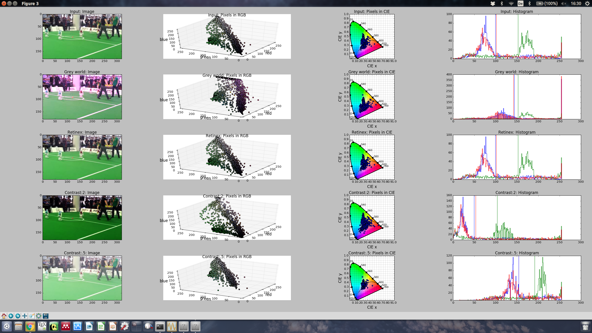

# Color and illumination computations, experiments and tools

## Viewer
Tool to analyze different aspects and visualize color related measures.

## Slides
Slides related to camera hardware, sensor specifics and parameters.
